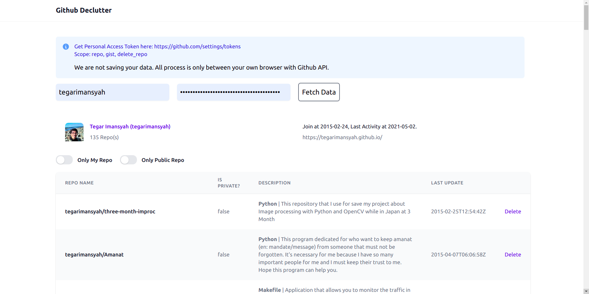

# Github Declutter

Declutter your unused repo. Create your github personal access token, give permission for these scopes:

* repo => To access your repo
* delete_repo => To delete your repo

then declutter your repo.



## Why I create this?

I create my github account when I can't really code, but I have a ton of ideas. Each ideas, I will create a repo but that's only half-baked code. Now I want to make my github profile more professional-look that show case my capabilities, removing unused repo and not mix up decent repos with my broken repos. Hope this can also help you.

Well, at least I relief github from hundreds of megabytes of my trash code.

## Tech Stack:

* [SvelteKit](https://svelte.dev/)
* [Github Rest API](https://docs.github.com/en/rest) called by [axios](https://axios-http.com/docs/intro)
* [Tailwind CSS](https://tailwindcss.com/) (some from [Tailwind UI](https://tailwindui.com))
* [DaisyUI](https://daisyui.com/)

## Development

```sh
$ npm install
$ npm run dev -- --host
```

## Contribution

* Bug report -> Create issue
* Feature request -> Create issue
* Ask something? -> Create issue or mention @tegar_imansyah in twitter
* Code contribution -> Read CONTRIBUTING.md

## Find it helpful?

* Share your story to your social media. Please also let me know by mentioning @tegar_imansyah or fill this form. 

## License: MIT